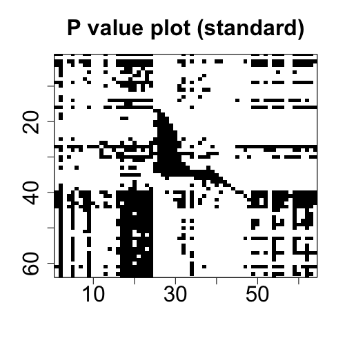

# TRES

<!-- badges: start -->
[](https://travis-ci.com/leozeng15/TRES)
[](https://CRAN.R-project.org/package=TRES)
<!-- badges: end -->

The package **TRES** implements the least squares and envelope estimation under the framework of tensor regression models. The general model-free envelope models can also be flexibly handled by the package via three types of envelope estimation algorithms: 
- Full Grassmannian (FG) algorithm.
- 1D algorithm.
- Envelope coordinate descent (ECD) algorithm
- Partial least squares (PLS) type algorithm.

## Installation

You can install the released version of TRES from [CRAN](https://CRAN.R-project.org) with:

``` r
# Install the latest released version from CRAN
install.packages("TRES")

# Or the development version from GitHub:
remotes::install_github("leozeng15/TRES")
```

## Example 1: Tensor response regression analysis

This is a basic example providing you a guidance on how to use the primary function `TRR.fit` and several **S**3 methods in Tensor Response Regression (TRR) model. The ordinary least square method and 1D envelope method are implemented. See Li and Zhang (2017) for more background.

``` r
library(TRES)
## Load data "bat"
data("bat")
x <- bat$x
y <- bat$y

## Fitting with OLS and 1D envelope method.
fit_ols <- TRR.fit(x, y, method="standard")
fit_1D <- TRR.fit(x, y, u = c(14,14), method="1D") # pass envelope rank (14,14)

## Print cofficient
coef(fit_1D)

## Print the summary
summary(fit_1D)

## Extract the mean squared error, p-value and standard error from summary
summary(fit_1D)$mse
summary(fit_1D)$p_val
summary(fit_1D)$se

## Make the prediction on the original dataset
predict(fit_1D, x)

## Draw the plots of two-way coefficient tensor (i.e., matrix) and p-value tensor.
plot(fit_ols)
plot(fit_1D)
```

The coefficients plots from OLS and 1D methods are aligned in the first row below, and the p-value plots from the two methods are aligned in the second row below.

<div>
  <br>
 
</div>

## Example 2: Model-free envelope estimation
This example shows how to use the function `MenU_sim` to simulate the matrices `M` and `U` with envelope structure, and how to use different core functions to implement different envelope estimation algorithms. See Cook and Zhang (2016) for more details.
``` r
## Generate matrices M and U
p <- 50
u <- 5
n <- 200
data <- MenvU_sim(p, u, jitter = 1e-5, wishart = TRUE, n = n)
Gamma <- data$Gamma
M <- data$M
U <- data$U

## Use different envelope algorithms
G <- vector("list", 6)
G[[1]] <- simplsMU(M, U, u)
G[[2]] <- ECD(M, U, u)
G[[3]] <- manifold1D(M, U, u)
G[[4]] <- OptM1D(M, U, u)
G[[5]] <- manifoldFG(M, U, u)
G[[6]] <- OptMFG(M, U, u)
```

## References

*1D algorithm*: Cook, R.D. and Zhang, X., 2016. Algorithms for envelope estimation. Journal of Computational and Graphical Statistics, 25(1), pp.284-300.

*TRR*: Li, L. and Zhang, X., 2017. Parsimonious tensor response regression. Journal of the American Statistical Association, 112(519), pp.1131-1146.

*TPR*: Zhang, X. and Li, L., 2017. Tensor envelope partial least-squares regression. Technometrics, 59(4), pp.426-436.


*ECD algorithm*: Cook, R.D. and Zhang, X., 2018. Fast envelope algorithms. Statistica Sinica, 28(3), pp.1179-1197.


