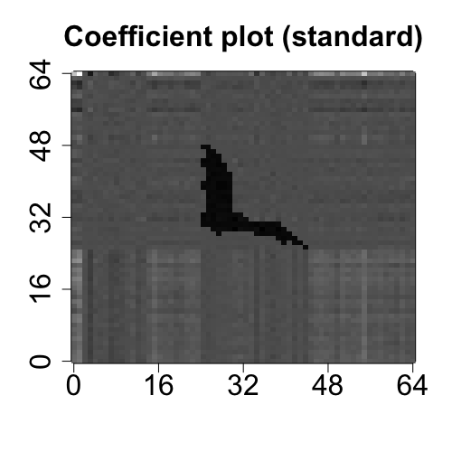
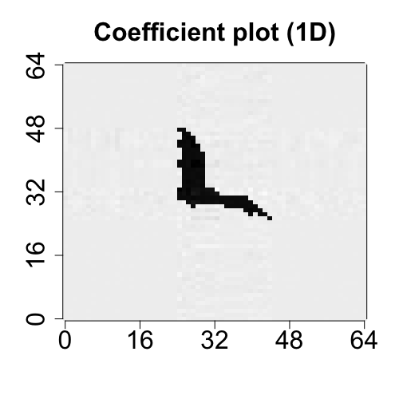
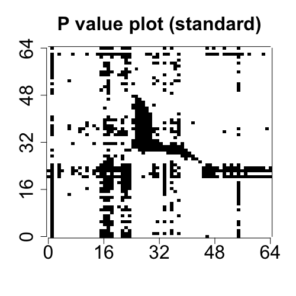
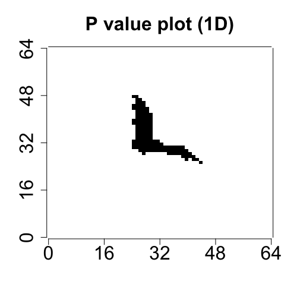

# TRES

<!-- badges: start -->
<!-- badges: end -->

The package **TRES** implements the least squares and envelope estimation under the framework of tensor regression models. The general model-free envelope models can also be flexibly handled by the package via three types of envelope estimation algorithms: 
- Full Grassmannian (FG) algorithm.
- 1D algorithm.
- Envelope coordinate descent (ECD) algorithm
- Partial least squares (PLS) type algorithm.

## Installation

You can install the released version of TRES from [CRAN](https://CRAN.R-project.org) with:

``` r
# Install the latest released version from CRAN
install.packages("TRES")

# Or the development version from GitHub:
remotes::install_github("jerryfsu3333/TRES")
```

## Example

This is a basic example providing you a guidance on how to use the primary function `TRR.fit` and several **S**3 methods in Tensor Response Regression (TRR) model. The ordinary least square method and 1D envelope method are implemented.

``` r
library(TRES)
## Load data "bat"
data("bat")
x <- bat$x
y <- bat$y

## Fitting with OLS and 1D envelope method.
fit_ols <- TRR.fit(x, y, method="standard")
fit_1D <- TRR.fit(x, y, u = c(14,14), method="1D") # pass envelope rank (14,14)

## Print cofficient
coef(fit_1D)

## Print the summary
summary(fit_1D)

## Extract the mean squared error, p-value and standard error from summary
summary(fit_1D)$mse
summary(fit_1D)$p_val
summary(fit_1D)$se

## Make the prediction on the original dataset
predict(fit_1D, x)

## Draw the plots of two-way coefficient tensor (i.e., matrix) and p-value tensor.
plot(fit_ols)
plot(fit_1D)
```

The coefficients plots from OLS and 1D methods are aligned in the first row below, and the p-value plots from the two methods are aligned in the second row below.

<div>
  <br>
 
</div>

## References

*TRR*: Li, Lexin, and Xin Zhang. "Parsimonious tensor response regression." Journal of the American Statistical Association 112.519 (2017): 1131-1146.

*TPR*: Zhang, Xin, and Lexin Li. "Tensor envelope partial least-squares regression." Technometrics 59.4 (2017): 426-436.

*1D algorithm*: Cook, R. D., & Zhang, X. (2016). Algorithms for envelope estimation. Journal of Computational and Graphical Statistics, 25(1), 284-300.

*ECD algorithm*: Cook, R. D., & Zhang, X. (2018). Fast envelope algorithms. Statistica Sinica, 28(3), 1179-1197.

 <!-- badges: start -->
  [](https://travis-ci.org/jerryfsu3333/TRES)
  <!-- badges: end -->

